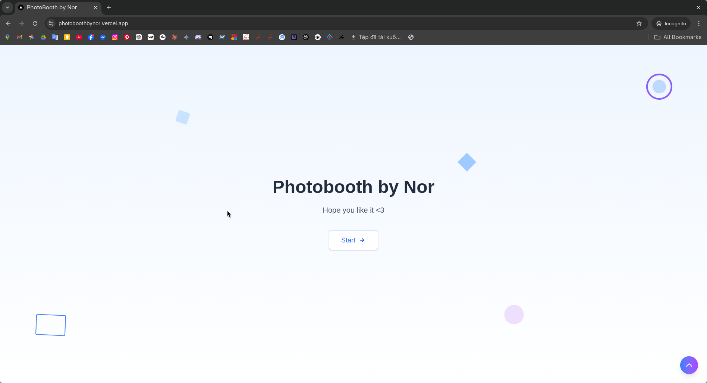

<div align="center">
  
</div>

<div align="center">

# Photobooth

<!-- Badges -->


</div>

A modern, browser-based photo booth web app that lets users capture photos with their webcam and create shareable snapshots—no native install required.

**Live Demo:** https://photoboothbynor.vercel.app/

[Insert Demo GIF here]

---

## Table of Contents
- [Introduction](#introduction)
- [Features](#features)
- [Installation](#installation)
- [Usage](#usage)
- [Contributing](#contributing)
- [License](#license)

---

## Introduction
**Photobooth** is a lightweight web application built with **Next.js** and **React** that turns your browser into a photo booth experience. It uses the device camera via the browser (with user permission), enabling quick photo capture and a fun, shareable result—ideal for events, personal projects, or quick “snap-and-save” workflows.

---

## Features
- **Webcam capture** directly in the browser (via `react-webcam`)
- **Snapshot export** / image capture support (via `html2canvas`)
- **Smooth animations** and UI transitions (via `framer-motion`)
- **Modern, responsive styling** with **Tailwind CSS**
- **Fast Next.js app router setup** for a clean, scalable structure

---

## Installation

### Prerequisites
- **Node.js**: `24.x` (as specified in the project `engines`)
- A package manager: **npm**

### Steps
1. Clone the repository:
   ```bash
   git clone https://github.com/Nor262/photobooth.git
   cd photobooth
   ```

2. Install dependencies:
   ```bash
   npm install
   ```

---

## Usage

### Run locally (development)
```bash
npm run dev
```

Then open:
```text
http://localhost:3000
```

> **Note:** When launching the app, your browser will prompt you for camera access. Please click **"Allow"** to enable the photobooth features.

### Build for production
```bash
npm run build
```

### Start production server
```bash
npm run start
```

### Lint
```bash
npm run lint
```

---

## Contributing
Contributions are welcome and appreciated.

1. Fork the repo
2. Create a feature branch:
   ```bash
   git checkout -b feature/your-feature-name
   ```
3. Commit your changes:
   ```bash
   git commit -m "Add: your feature description"
   ```
4. Push to your fork:
   ```bash
   git push origin feature/your-feature-name
   ```
5. Open a Pull Request

Please keep PRs focused, include screenshots/GIFs for UI changes when possible, and follow the existing project style.

---

## License
This project is currently **unlicensed** (no `LICENSE` file is present in the repository).